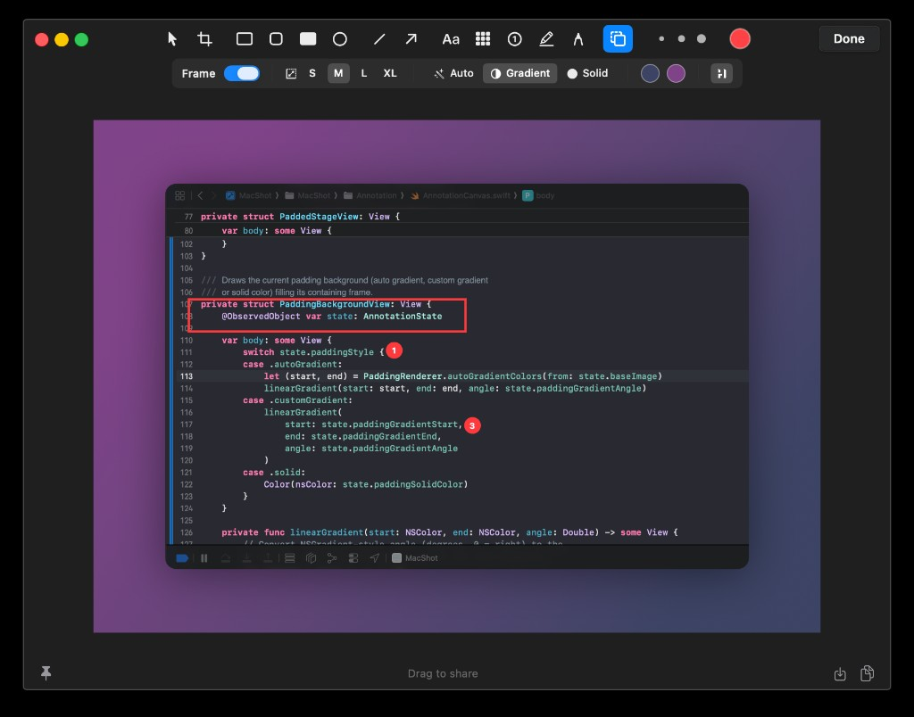

# MacShot

A native macOS screenshot and annotation tool inspired by [CleanShot X](https://cleanshot.com). Built with Swift, SwiftUI, and AppKit.

> This project was vibecoded with [Cursor](https://cursor.com).



## Features

- **Screen Capture** — fullscreen, area selection, and window capture modes (window captures return only the window's own pixels, no wallpaper bleed)
- **Annotation Editor** — built-in editor with a dark toolbar matching the CleanShot X aesthetic
  - Shapes: rectangle, rounded rectangle, filled rectangle, circle
  - Drawing: line, arrow (with multiple styles), freehand pencil
  - Text annotations with inline editing
  - Highlighter brush for marking up text
  - Pixelate/blur tool for redacting sensitive content
  - Numbered counter stamps
  - Crop tool with draggable handles (with proper undo support)
  - Configurable line width and color
- **Frame / Background** — wrap the screenshot in a decorative frame with an auto-generated gradient sampled from the image pixels, a custom gradient, or a solid color — plus rounded corners and drop shadow. Enabled by default for window captures; available as an optional tool for every other capture mode
- **Pin to Desktop** — pin screenshots as floating windows
- **Drag to Share** — drag the screenshot directly from the editor to any app
- **Save & Copy** — save to a configurable directory or copy to clipboard
- **Scrolling Capture** — capture content that extends beyond the visible screen
- **Self Timer** — delayed capture with countdown
- **Keyboard Shortcuts** — configurable global hotkeys
- **Menu Bar App** — lives in the menu bar, out of the way

## Requirements

- macOS 14.0+
- Xcode 15+ / Swift 5.9+

## Build

```bash
cd MacShot
swift build
```

To run:

```bash
swift run
```

Or open `Package.swift` in Xcode and hit Run.

## Project Structure

```
MacShot/
├── Sources/MacShot/
│   ├── MacShotApp.swift          # App entry point
│   ├── Annotation/               # Annotation editor
│   │   ├── AnnotationEditorWindow.swift
│   │   ├── AnnotationToolbar.swift
│   │   ├── AnnotationCanvas.swift
│   │   ├── AnnotationEditorManager.swift
│   │   ├── Models/               # Data models & state
│   │   └── Tools/                # Renderer, crop tool, padding/frame renderer
│   ├── Capture/                  # Screenshot capture logic
│   ├── Core/                     # App state, permissions, shortcuts
│   ├── MenuBar/                  # Menu bar integration
│   ├── Overlay/                  # Overlay, pin windows, drag source
│   ├── Settings/                 # Settings views
│   └── Utilities/                # File naming, history, desktop icons
└── Tests/MacShotTests/
```

## License

MIT
